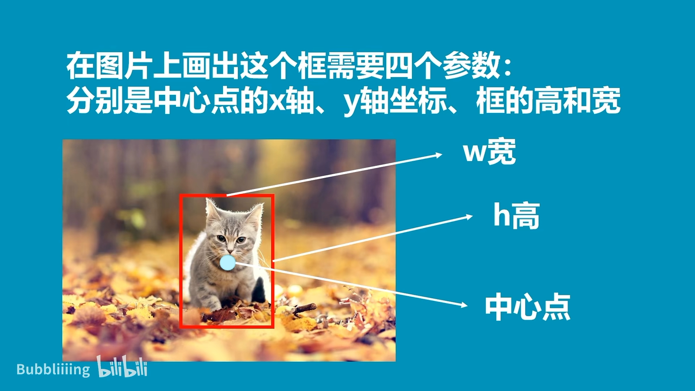
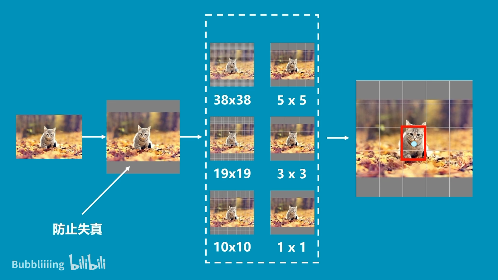
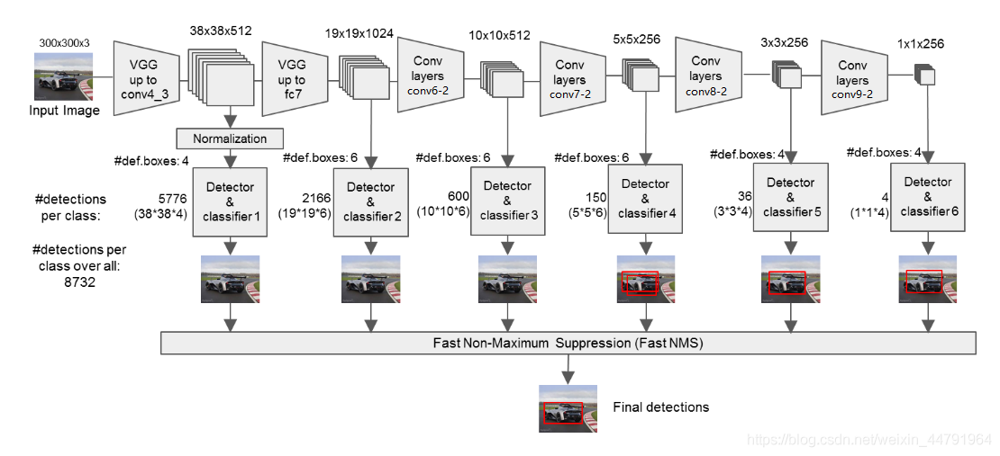
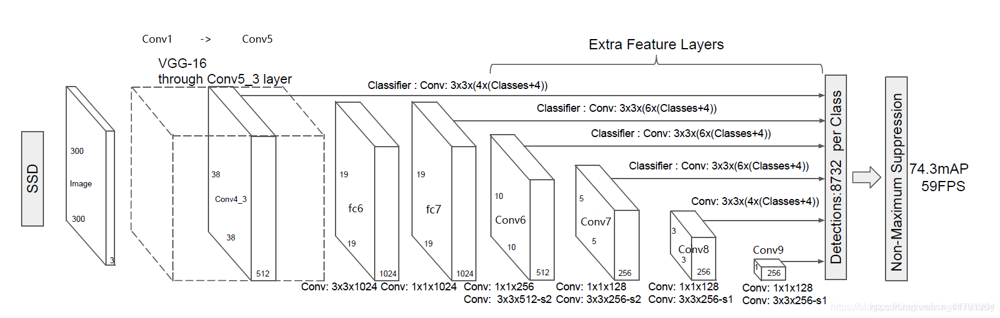
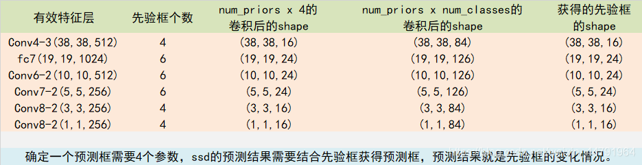

#



# 分为6种网格大小

> 将图像划分为不同大小的网格
>
> 38x38 19x19的感受野小,负责预测小的物体
>
> 10x10 5x5的感受野中,负责预测中的物体
>
> 3x3 1x1的感受野大,负责预测大的物体




# 什么是SSD目标检测算法

SSD是一种非常优秀的one-stage目标检测方法，one-stage算法就是**目标检测**和**分类**是同时完成的，**其主要思路是利用CNN提取特征后，均匀地在图片的不同位置进行密集抽样，抽样时可以采用不同尺度和长宽比，物体分类与预测框的回归同时进行，整个过程只需要一步，所以其优势是速度快**。

但是均匀的密集采样的一个重要缺点是训练比较困难，这主要是因为正样本与负样本（背景）极其不均衡（参见Focal Loss），导致模型准确度稍低。

**SSD的英文全名是Single Shot MultiBox Detector，Single shot说明SSD算法属于one-stage方法，MultiBox说明SSD算法基于多框预测。**

# 源码下载

https://github.com/bubbliiiing/ssd-pytorch


# SSD实现思路

## 一、预测部分

### 1、主干网络介绍



SSD采用的主干网络是VGG网络，关于VGG的介绍大家可以看我的另外一篇博客https://blog.csdn.net/weixin_44791964/article/details/102779878，这里的VGG网络相比普通的VGG网络有一定的修改，主要修改的地方就是：

1. **将VGG16的FC6和FC7层转化为卷积层。**
2. **去掉所有的Dropout层和FC8层；**
3. **新增了Conv6、Conv7、Conv8、Conv9。**



如图所示，输入的图片经过了**改进的VGG网络**（Conv1->fc7）和几个另加的卷积层（Conv6->Conv9），进行特征提取：

1. **输入一张图片后，被resize到300x300的shape**
2. **conv1，经过两次[3,3]卷积网络，输出的特征层为64，输出为(300,300,64)，再2X2最大池化，该最大池化步长为2，输出net为(150,150,64)。**
3. **conv2，经过两次[3,3]卷积网络，输出的特征层为128，输出net为(150,150,128)，再2X2最大池化，该最大池化步长为2，输出net为(75,75,128)。**
4. **conv3，经过三次[3,3]卷积网络，输出的特征层为256，输出net为(75,75,256)，再2X2最大池化，该最大池化步长为2，输出net为(38,38,256)。**
5. **conv4，经过三次[3,3]卷积网络，输出的特征层为512，输出net为(38,38,512)，再2X2最大池化，该最大池化步长为2，输出net为(19,19,512)。**
6. **conv5，经过三次[3,3]卷积网络，输出的特征层为512，输出net为(19,19,512)，再3X3最大池化，该最大池化步长为1，输出net为(19,19,512)。**
7. **利用卷积代替全连接层，进行了一次[3,3]卷积网络和一次[1,1]卷积网络，分别为fc6和fc7，输出的通道数为1024，因此输出的net为(19,19,1024)。**（从这里往前都是VGG的结构）
8. **conv6，经过一次[1,1]卷积网络，调整通道数，一次步长为2的[3,3]卷积网络，输出的通道数为512，因此输出的net为(10,10,512)。**
9. **conv7，经过一次[1,1]卷积网络，调整通道数，一次步长为2的[3,3]卷积网络，输出的通道数为256，因此输出的net为(5,5,256)。**
10. **conv8，经过一次[1,1]卷积网络，调整通道数，一次padding为valid的[3,3]卷积网络，输出的通道数为256，因此输出的net为(3,3,256)。**
11. **conv9，经过一次[1,1]卷积网络，调整通道数，一次padding为valid的[3,3]卷积网络，输出的特征层为256，因此输出的net为(1,1,256)。**

utils/vgg.py

```python
import torch.nn as nn
from torch.hub import load_state_dict_from_url


'''
修改的vgg,后面的几层在ssd.py中

该代码用于获得VGG主干特征提取网络的输出。
输入变量i代表的是输入图片的通道数，通常为3。

每行最后都是pooling,宽高减半
300, 300, 3 -> 300, 300, 64 -> 300, 300, 64 -> 150, 150, 64 ->  conv1
150, 150, 128 -> 150, 150, 128 -> 75, 75, 128 ->                conv2
75, 75, 256 -> 75, 75, 256 -> 75, 75, 256 -> 38, 38, 256 ->     conv3
38, 38, 512 -> 38, 38, 512 -> 38, 38, 512 -> 19, 19, 512 ->     conv4
19, 19, 512 -> 19, 19, 512 -> 19, 19, 512 -> 19, 19, 512 ->     conv5
19, 19, 1024 -> 19, 19, 1024  修改后新增的                       pool5 conv6 conv7

最后一个 38, 38, 512  的id是22
最后一个 19, 19, 1024 的id是34
'''
base = [64, 64, 'M', 128, 128, 'M', 256, 256, 256, 'C', 512, 512, 512, 'M', 512, 512, 512]

def vgg(pretrained = False):
    layers = []
    in_channels = 3
    for v in base:
        if v == 'M':
            layers += [nn.MaxPool2d(kernel_size=2, stride=2)]
        elif v == 'C':
            layers += [nn.MaxPool2d(kernel_size=2, stride=2, ceil_mode=True)]   # ceil_mode: False,右或下不足pool就舍弃;True就要
        else:
            conv2d = nn.Conv2d(in_channels, v, kernel_size=3, padding=1)
            layers += [conv2d, nn.ReLU(inplace=True)]
            in_channels = v
    # 19, 19, 512 -> 19, 19, 512  stride=1 宽高不变
    pool5 = nn.MaxPool2d(kernel_size=3, stride=1, padding=1)
    # 19, 19, 512 -> 19, 19, 1024
    conv6 = nn.Conv2d(512, 1024, kernel_size=3, padding=6, dilation=6)
    # 19, 19, 1024 -> 19, 19, 1024
    conv7 = nn.Conv2d(1024, 1024, kernel_size=1)
    layers += [pool5, conv6,
                nn.ReLU(inplace=True), conv7, nn.ReLU(inplace=True)]

    # 放进列表中
    model = nn.ModuleList(layers)
    if pretrained:
        state_dict = load_state_dict_from_url("https://download.pytorch.org/models/vgg16-397923af.pth", model_dir="./model_data")
        state_dict = {k.replace('features.', '') : v for k, v in state_dict.items()}
        model.load_state_dict(state_dict, strict = False)
    return model

if __name__ == "__main__":
    net = vgg()
    for i, layer in enumerate(net):
        print(i, layer)
```

### 2、从特征获取预测结果


由上图可知，我们分别取：

- **conv4的第三次卷积的特征；**
- **fc7卷积的特征；**
- **conv6的第二次卷积的特征；**
- **conv7的第二次卷积的特征；**
- **conv8的第二次卷积的特征；**
- **conv9的第二次卷积的特征。**

共六个特征层进行下一步的处理。为了和普通特征层区分，我们称之为**有效特征层**，来获取预测结果。

对获取到的**每一个有效特征层**，我们都需要对其**做两个操作**，分别是：

- **一次num_anchors x 4的卷积**
- **一次num_anchors x num_classes的卷积**

而**num_anchors指的是该特征层每一个特征点**所拥有的先验框数量。上述提到的六个特征层，**每个特征层的每个特征点对应的先验框数量分别为4、6、6、6、4、4。**

上述操作分别对应的对象为：

- **num_anchors x 4的卷积** 用于预测 **该特征层上每一个网格点上 每一个先验框**的变化情况。
- **num_anchors x num_classes的卷积** 用于预测 **该特征层上** **每一个网格点上** **每一个预测**对应的种类。

所有的特征层对应的预测结果的shape如下：

所有的特征层对应的预测结果



> nets/ssd.py

```python
class SSD300(nn.Module):
    def __init__(self, num_classes, backbone_name, pretrained = False):
        super().__init__()
        self.num_classes    = num_classes
        if backbone_name    == "vgg":
            self.vgg        = add_vgg(pretrained)
            self.extras     = add_extras(1024, backbone_name)
            self.L2Norm     = L2Norm(512, 20)       # L2标准化
            mbox            = [4, 6, 6, 6, 4, 4]    # 分类框个数

            loc_layers      = []
            conf_layers     = []

            # 最后一个 38, 38, 512  的序号是22,是relu,不过取不到通道数,所以取前面一个
            # 最后一个 19, 19, 1024 的序号是34,是relu,不过取不到通道数,所以取前面一个
            backbone_source = [21, -2]
            #---------------------------------------------------#
            #   在add_vgg获得的特征层里
            #   第21层和-2层可以用来进行回归预测和分类预测。
            #   分别是conv4-3(38,38,512)和conv7(19,19,1024)的输出
            #---------------------------------------------------#
            for k, v in enumerate(backbone_source):
                # 回归预测,输出结果是num_anchor x 4
                loc_layers  += [nn.Conv2d(self.vgg[v].out_channels, mbox[k] * 4, kernel_size = 3, padding = 1)]
                # 分类预测,输出结果是num_anchor x num_classes
                conf_layers += [nn.Conv2d(self.vgg[v].out_channels, mbox[k] * num_classes, kernel_size = 3, padding = 1)]
            #-------------------------------------------------------------#
            #   在add_extras获得的特征层里
            #   第1层、第3层、第5层、第7层可以用来进行回归预测和分类预测。
            #   shape分别为(10,10,512), (5,5,256), (3,3,256), (1,1,256)
            #-------------------------------------------------------------#
            for k, v in enumerate(self.extras[1::2], 2):    # 1::2 隔两个取一次 2: 序号开始为2
                loc_layers  += [nn.Conv2d(v.out_channels, mbox[k] * 4, kernel_size = 3, padding = 1)]
                conf_layers += [nn.Conv2d(v.out_channels, mbox[k] * num_classes, kernel_size = 3, padding = 1)]
        else:
            self.mobilenet  = mobilenet_v2(pretrained).features
            self.extras     = add_extras(1280, backbone_name)
            self.L2Norm     = L2Norm(96, 20)
            mbox            = [6, 6, 6, 6, 6, 6]

            loc_layers      = []
            conf_layers     = []
            backbone_source = [13, -1]
            for k, v in enumerate(backbone_source):
                loc_layers  += [nn.Conv2d(self.mobilenet[v].out_channels, mbox[k] * 4, kernel_size = 3, padding = 1)]
                conf_layers += [nn.Conv2d(self.mobilenet[v].out_channels, mbox[k] * num_classes, kernel_size = 3, padding = 1)]
            for k, v in enumerate(self.extras, 2):
                loc_layers  += [nn.Conv2d(v.out_channels, mbox[k] * 4, kernel_size = 3, padding = 1)]
                conf_layers += [nn.Conv2d(v.out_channels, mbox[k] * num_classes, kernel_size = 3, padding = 1)]

        self.loc            = nn.ModuleList(loc_layers)     # 回归预测,位置
        self.conf           = nn.ModuleList(conf_layers)    # 分类预测
        self.backbone_name  = backbone_name

    def forward(self, x):
        #---------------------------#
        #   x是300,300,3
        #   sources: 六个有效特征层
        #   loc:  回归预测,位置
        #   conf: 分类预测
        #---------------------------#
        sources = list()
        loc     = list()
        conf    = list()

        #---------------------------#
        #   获得conv4_3的内容
        #   shape为38,38,512
        #---------------------------#
        if self.backbone_name == "vgg":
            for k in range(23): # 前22层
                x = self.vgg[k](x)
        else:
            for k in range(14):
                x = self.mobilenet[k](x)
        #---------------------------#
        #   conv4_3的内容
        #   需要进行L2标准化
        #---------------------------#
        s = self.L2Norm(x)
        sources.append(s)

        #---------------------------#
        #   获得conv7的内容
        #   shape为19,19,1024
        #---------------------------#
        if self.backbone_name == "vgg":
            for k in range(23, len(self.vgg)):
                x = self.vgg[k](x)
        else:
            for k in range(14, len(self.mobilenet)):
                x = self.mobilenet[k](x)

        sources.append(x)
        #-------------------------------------------------------------#
        #   在add_extras获得的特征层里
        #   第1层、第3层、第5层、第7层可以用来进行回归预测和分类预测。
        #   shape分别为(10,10,512), (5,5,256), (3,3,256), (1,1,256)
        #-------------------------------------------------------------#
        for k, v in enumerate(self.extras):
            x = F.relu(v(x), inplace=True)
            if self.backbone_name == "vgg":
                if k % 2 == 1:
                    sources.append(x)
            else:
                sources.append(x)

        #-------------------------------------------------------------#
        #   为获得的6个有效特征层添加回归预测和分类预测
        #   将sources传入loc和conf中计算
        #   将channel转移到最后维度
        #-------------------------------------------------------------#
        for (x, l, c) in zip(sources, self.loc, self.conf):
            loc.append( l(x).permute(0, 2, 3, 1).contiguous())
            conf.append(c(x).permute(0, 2, 3, 1).contiguous())

        #-------------------------------------------------------------#
        #   进行reshape方便堆叠
        #   转化为2维的, 疑问:经过卷积后高宽是不同的,变为二维的长度不同该如何拼接呢???
        #-------------------------------------------------------------#
        loc     = torch.cat([o.view(o.size(0), -1) for o in loc],  1)
        conf    = torch.cat([o.view(o.size(0), -1) for o in conf], 1)

        #-------------------------------------------------------------#
        #   loc会reshape到batch_size, num_anchors, 4
        #   conf会reshap到batch_size, num_anchors, self.num_classes
        #-------------------------------------------------------------#
        output = (
            loc.view(loc.size(0), -1, 4),
            conf.view(conf.size(0), -1, self.num_classes),
        )
        return output
```

### 3、预测结果的解码

利用SSD的主干网络我们可以获得六个有效特征层，分别是：

- **conv4的第三次卷积的特征；**
- **fc7卷积的特征；**
- **conv6的第二次卷积的特征；**
- **conv7的第二次卷积的特征；**
- **conv8的第二次卷积的特征；**
- **conv9的第二次卷积的特征。**

通过对每一个特征层的处理，我们可以获得每个特征层对应的两个内容，分别是：

- **num_anchors x 4的卷积** 用于预测 **该特征层上** **每一个网格点上 每一个先验框**的变化情况。
- **num_anchors x num_classes的卷积** 用于预测 **该特征层上** **每一个网格点上** **每一个预测**对应的种类。

我们利用 **num_anchors x 4的卷积** 对 **每一个有效特征层对应的先验框** 进行调整获得 **预测框**。

在这里我们简单了解一下每个特征层到底做了什么：

每一个有效特征层将整个图片分成与其**长宽对应的网格**，**如conv4-3的特征层就是将整个图像分成38x38个网格；然后从每个网格中心建立多个先验框，对于conv4-3的特征层来说，它的每个特征点分别建立了4个先验框；**

因此，对于conv4-3整个特征层来讲，**整个图片被分成38x38个网格，每个网格中心对应4个先验框，一共建立了38x38x4个，5776个先验框**。这些框**密密麻麻的遍布在整个图片上**。**网络的预测结果会对这些框进行调整获得预测框。**


先验框虽然可以代表一定的**框的位置信息与框的大小信息**，但是其是有限的，无法表示任意情况，因此还需要调整，ssd利用**num_anchors x 4的卷积**的结果对先验框进行调整。

**num_anchors x 4中的num_anchors表示了这个网格点所包含的先验框数量，其中的4表示了x_offset、y_offset、h和w的调整情况。**

**x_offset与y_offset代表了真实框距离先验框中心的xy轴偏移情况。**

**h和w代表了真实框的宽与高相对于先验框的变化情况。**

SSD解码过程可以分为两部分：

将**每个网格的中心点加上它对应的x_offset和y_offset，加完后的结果就是预测框的中心；**

利用**h和w调整先验框获得预测框的宽和高。**

此时我们获得了**预测框的中心和预测框的宽高**，已经可以在图片上**绘制预测框**了。


想要获得**最终的预测结果**，还要对**每一个预测框**进行**得分排序**与**非极大抑制筛选**。

这一部分基本上是所有目标检测通用的部分。

1. 取出**每一类得分大于self.obj_threshold的框和得分**。
2. 利用**框的位置和得分**进行非极大抑制。

> utils/utils_bbox.py

```python
import numpy as np
import torch
from torch import nn
from torchvision.ops import nms


class BBoxUtility(object):
    def __init__(self, num_classes):
        self.num_classes    = num_classes

    def ssd_correct_boxes(self, box_xy, box_wh, input_shape, image_shape, letterbox_image):
        #-----------------------------------------------------------------#
        #   把y轴放前面是因为方便预测框和图像的宽高进行相乘
        #-----------------------------------------------------------------#
        box_yx = box_xy[..., ::-1]
        box_hw = box_wh[..., ::-1]
        input_shape = np.array(input_shape)
        image_shape = np.array(image_shape)

        if letterbox_image:
            #-----------------------------------------------------------------#
            #   这里求出来的offset是图像有效区域相对于图像左上角的偏移情况
            #   new_shape指的是宽高缩放情况
            #-----------------------------------------------------------------#
            new_shape = np.round(image_shape * np.min(input_shape/image_shape))
            offset  = (input_shape - new_shape)/2./input_shape
            scale   = input_shape/new_shape

            box_yx  = (box_yx - offset) * scale
            box_hw *= scale

        box_mins    = box_yx - (box_hw / 2.)
        box_maxes   = box_yx + (box_hw / 2.)
        boxes  = np.concatenate([box_mins[..., 0:1], box_mins[..., 1:2], box_maxes[..., 0:1], box_maxes[..., 1:2]], axis=-1)
        boxes *= np.concatenate([image_shape, image_shape], axis=-1)
        return boxes

    def decode_boxes(self, mbox_loc, anchors, variances):
        # 获得先验框的宽与高
        anchor_width     = anchors[:, 2] - anchors[:, 0]
        anchor_height    = anchors[:, 3] - anchors[:, 1]
        # 获得先验框的中心点
        anchor_center_x  = 0.5 * (anchors[:, 2] + anchors[:, 0])
        anchor_center_y  = 0.5 * (anchors[:, 3] + anchors[:, 1])

        # 真实框距离先验框中心的xy轴偏移情况
        decode_bbox_center_x = mbox_loc[:, 0] * anchor_width * variances[0]
        decode_bbox_center_x += anchor_center_x
        decode_bbox_center_y = mbox_loc[:, 1] * anchor_height * variances[0]
        decode_bbox_center_y += anchor_center_y
        
        # 真实框的宽与高的求取
        decode_bbox_width   = torch.exp(mbox_loc[:, 2] * variances[1])
        decode_bbox_width   *= anchor_width
        decode_bbox_height  = torch.exp(mbox_loc[:, 3] * variances[1])
        decode_bbox_height  *= anchor_height

        # 获取真实框的左上角与右下角
        decode_bbox_xmin = decode_bbox_center_x - 0.5 * decode_bbox_width
        decode_bbox_ymin = decode_bbox_center_y - 0.5 * decode_bbox_height
        decode_bbox_xmax = decode_bbox_center_x + 0.5 * decode_bbox_width
        decode_bbox_ymax = decode_bbox_center_y + 0.5 * decode_bbox_height

        # 真实框的左上角与右下角进行堆叠
        decode_bbox = torch.cat((decode_bbox_xmin[:, None],
                                      decode_bbox_ymin[:, None],
                                      decode_bbox_xmax[:, None],
                                      decode_bbox_ymax[:, None]), dim=-1)
        # 防止超出0与1
        decode_bbox = torch.min(torch.max(decode_bbox, torch.zeros_like(decode_bbox)), torch.ones_like(decode_bbox))
        return decode_bbox

    def decode_box(self, predictions, anchors, image_shape, input_shape, letterbox_image, variances = [0.1, 0.2], nms_iou = 0.3, confidence = 0.5):
        #---------------------------------------------------#
        #   :4是回归预测结果
        #---------------------------------------------------#
        mbox_loc        = predictions[0]
        #---------------------------------------------------#
        #   获得种类的置信度
        #---------------------------------------------------#
        mbox_conf       = nn.Softmax(-1)(predictions[1])

        results = []
        #----------------------------------------------------------------------------------------------------------------#
        #   对每一张图片进行处理，由于在predict.py的时候，我们只输入一张图片，所以for i in range(len(mbox_loc))只进行一次
        #----------------------------------------------------------------------------------------------------------------#
        for i in range(len(mbox_loc)):
            results.append([])
            #--------------------------------#
            #   利用回归结果对先验框进行解码
            #--------------------------------#
            decode_bbox = self.decode_boxes(mbox_loc[i], anchors, variances)

            for c in range(1, self.num_classes):
                #--------------------------------#
                #   取出属于该类的所有框的置信度
                #   判断是否大于门限
                #--------------------------------#
                c_confs     = mbox_conf[i, :, c]
                c_confs_m   = c_confs > confidence
                if len(c_confs[c_confs_m]) > 0:
                    #-----------------------------------------#
                    #   取出得分高于confidence的框
                    #-----------------------------------------#
                    boxes_to_process = decode_bbox[c_confs_m]
                    confs_to_process = c_confs[c_confs_m]

                    keep = nms(
                        boxes_to_process,
                        confs_to_process,
                        nms_iou
                    )
                    #-----------------------------------------#
                    #   取出在非极大抑制中效果较好的内容
                    #-----------------------------------------#
                    good_boxes  = boxes_to_process[keep]
                    confs       = confs_to_process[keep][:, None]
                    labels      = (c - 1) * torch.ones((len(keep), 1)).cuda() if confs.is_cuda else torch.ones((len(keep), 1))
                    #-----------------------------------------#
                    #   将label、置信度、框的位置进行堆叠。
                    #-----------------------------------------#
                    c_pred      = torch.cat((good_boxes, labels, confs), dim=1).cpu().numpy()
                    # 添加进result里
                    results[-1].extend(c_pred)

            if len(results[-1]) > 0:
                results[-1] = np.array(results[-1])
                box_xy, box_wh = (results[-1][:, 0:2] + results[-1][:, 2:4])/2, results[-1][:, 2:4] - results[-1][:, 0:2]
                results[-1][:, :4] = self.ssd_correct_boxes(box_xy, box_wh, input_shape, image_shape, letterbox_image)

        return results
```

### 4、在原图上进行绘制

通过第三步，我们可以获得预测框在原图上的位置，而且这些预测框都是经过筛选的。这些筛选后的框可以直接绘制在图片上，就可以获得结果了。

## 二、训练部分

### 1、真实框的处理

真实框的处理可以分为两个部分，分别是：

- 找到**真实框对应的先验框**；
- **对真实框进行编码。**

#### a、找到真实框对应的先验框

在这一步中，我们需要找到真实框所对应的先验框，代表**这个真实框由某个先验框进行预测。**

我们首先需要将**每一个的真实框和所有的先验框进行一个iou计算**，这一步做的工作是计算**每一个真实框和所有的先验框的重合程度。**

在获得**每一个真实框和所有的先验框的重合程度**之后，选出和**每一个真实框重合程度大于一定门限的先验框**。代表**这个真实框由这些先验框负责预测。**

**由于一个先验框只能负责一个真实框的预测，所以如果某个先验框和多个真实框的重合度较大，那么这个先验框只负责与其iou最大的真实框的预测。**

在这一步后，我们可以找到**每一个先验框所负责预测的真实框**，在下一步中，我们需要根据**这些真实框和先验框获得网络的预测结果。**

> utils/dataloader.py

```python
def iou(self, box):
    #---------------------------------------------#
    #   计算出每个真实框与所有的先验框的iou
    #   判断真实框与先验框的重合情况
    #---------------------------------------------#
    inter_upleft    = np.maximum(self.anchors[:, :2], box[:2])
    inter_botright  = np.minimum(self.anchors[:, 2:4], box[2:])

    inter_wh    = inter_botright - inter_upleft
    inter_wh    = np.maximum(inter_wh, 0)
    inter       = inter_wh[:, 0] * inter_wh[:, 1]
    #---------------------------------------------# 
    #   真实框的面积
    #---------------------------------------------#
    area_true = (box[2] - box[0]) * (box[3] - box[1])
    #---------------------------------------------#
    #   先验框的面积
    #---------------------------------------------#
    area_gt = (self.anchors[:, 2] - self.anchors[:, 0])*(self.anchors[:, 3] - self.anchors[:, 1])
    #---------------------------------------------#
    #   计算iou
    #---------------------------------------------#
    union = area_true + area_gt - inter

    iou = inter / union
    return iou

def encode_box(self, box, return_iou=True, variances = [0.1, 0.1, 0.2, 0.2]):
    #---------------------------------------------#
    #   计算当前真实框和先验框的重合情况
    #   iou [self.num_anchors]
    #   encoded_box [self.num_anchors, 5]
    #---------------------------------------------#
    iou = self.iou(box)
    encoded_box = np.zeros((self.num_anchors, 4 + return_iou))
    
    #---------------------------------------------#
    #   找到每一个真实框，重合程度较高的先验框
    #   真实框可以由这个先验框来负责预测
    #---------------------------------------------#
    assign_mask = iou > self.overlap_threshold

    #---------------------------------------------#
    #   如果没有一个先验框重合度大于self.overlap_threshold
    #   则选择重合度最大的为正样本
    #---------------------------------------------#
    if not assign_mask.any():
        assign_mask[iou.argmax()] = True
    
    #---------------------------------------------#
    #   利用iou进行赋值 
    #---------------------------------------------#
    if return_iou:
        encoded_box[:, -1][assign_mask] = iou[assign_mask]
    
    #---------------------------------------------#
    #   找到对应的先验框
    #---------------------------------------------#
    assigned_anchors = self.anchors[assign_mask]
```

#### b、真实框的编码

利用SSD的主干网络我们可以获得六个有效特征层，分别是：

- **conv4的第三次卷积的特征；**
- **fc7卷积的特征；**
- **conv6的第二次卷积的特征；**
- **conv7的第二次卷积的特征；**
- **conv8的第二次卷积的特征；**
- **conv9的第二次卷积的特征。**

通过对每一个特征层的处理，我们可以获得每个特征层对应的三个内容，分别是：

- **num_anchors x 4的卷积** 用于预测 **该特征层上** **每一个网格点上 每一个先验框**的变化情况。
- **num_anchors x num_classes的卷积** 用于预测 **该特征层上** **每一个网格点上** **每一个预测**对应的种类。
- **每一个特征层**的**每一个特征点**上对应的**若干个先验框**。

因此，**我们直接利用ssd网络预测到的结果，并不是预测框在图片上的真实位置，需要解码才能得到真实位置。**

所以在训练的时候，如果**我们需要计算loss函数，这个loss函数是相对于ssd网络的预测结果的**。因此我们需要**对真实框的信息**进行处理，**使得它的结构和预测结果的格式是一样的**，这样的**一个过程我们称之为编码（encode）**。用一句话概括**编码的过程**就是将**真实框的位置信息格式转化为ssd预测结果的格式信息**。

也就是，我们需要找到 **每一张用于训练的图片**的**每一个真实框对应的先验框**，并求出**如果想要得到这样一个真实框，我们的预测结果应该是怎么样的。**

**从预测结果获得真实框的过程被称作解码，而从真实框获得预测结果的过程就是编码的过程**。因此我们只需要将**解码过程逆过来就是编码过程了。**

因此我们可以利用真实框和先验框进行编码，获得该特征点对应的该先验框应该有的预测结果。预测结果分为两个，分别是：

- **num_anchors x 4的卷积**

- **num_anchors x num_classes的卷积**

**前者对应先验框的调整参数，后者对应先验框的种类，这个都可以通过先验框对应的真实框获得。**

> utils/dataloader.py

```python
#---------------------------------------------#
#   逆向编码，将真实框转化为ssd预测结果的格式
#   先计算真实框的中心与长宽
#---------------------------------------------#
box_center  = 0.5 * (box[:2] + box[2:])
box_wh      = box[2:] - box[:2]
#---------------------------------------------#
#   再计算重合度较高的先验框的中心与长宽
#---------------------------------------------#
assigned_anchors_center = (assigned_anchors[:, 0:2] + assigned_anchors[:, 2:4]) * 0.5
assigned_anchors_wh     = (assigned_anchors[:, 2:4] - assigned_anchors[:, 0:2])

#------------------------------------------------#
#   逆向求取ssd应该有的预测结果
#   先求取中心的预测结果，再求取宽高的预测结果
#   存在改变数量级的参数，默认为[0.1,0.1,0.2,0.2]
#------------------------------------------------#
encoded_box[:, :2][assign_mask] = box_center - assigned_anchors_center
encoded_box[:, :2][assign_mask] /= assigned_anchors_wh
encoded_box[:, :2][assign_mask] /= np.array(variances)[:2]

encoded_box[:, 2:4][assign_mask] = np.log(box_wh / assigned_anchors_wh)
encoded_box[:, 2:4][assign_mask] /= np.array(variances)[2:4]
return encoded_box.ravel()
```

### 2、利用处理完的真实框与对应图片的预测结果计算loss

loss的计算分为三个部分：

1. 获取所有正标签的框的预测结果的回归loss。
2. 获取所有正标签的种类的预测结果的交叉熵loss。
3. 获取一定负标签的种类的预测结果的交叉熵loss。

由于在ssd的训练过程中，**正负样本极其不平衡，即 存在对应真实框的先验框可能只有若干个，但是不存在对应真实框的负样本却有几千个，这就会导致负样本的loss值极大**，因此**我们可以考虑减少负样本的选取，对于ssd的训练来讲，常见的情况是取三倍正样本数量的负样本用于训练**。这个三倍呢，也可以修改，调整成自己喜欢的数字。

> nets/ssd_training.py

```python
import torch
import torch.nn as nn
import torch.nn.functional as F

class MultiboxLoss(nn.Module):
    def __init__(self, num_classes, alpha=1.0, neg_pos_ratio=3.0,
                 background_label_id=0, negatives_for_hard=100.0):
        self.num_classes = num_classes
        self.alpha = alpha
        self.neg_pos_ratio = neg_pos_ratio
        if background_label_id != 0:
            raise Exception('Only 0 as background label id is supported')
        self.background_label_id = background_label_id
        self.negatives_for_hard = negatives_for_hard

    def _l1_smooth_loss(self, y_true, y_pred):
        abs_loss = torch.abs(y_true - y_pred)
        sq_loss = 0.5 * (y_true - y_pred)**2
        l1_loss = torch.where(abs_loss < 1.0, sq_loss, abs_loss - 0.5)
        return torch.sum(l1_loss, -1)

    def _softmax_loss(self, y_true, y_pred):
        y_pred = torch.clamp(y_pred, min = 1e-7)
        softmax_loss = -torch.sum(y_true * torch.log(y_pred),
                                      axis=-1)
        return softmax_loss

    def forward(self, y_true, y_pred):
        # --------------------------------------------- #
        #   y_true batch_size, 8732, 4 + self.num_classes + 1
        #   y_pred batch_size, 8732, 4 + self.num_classes
        # --------------------------------------------- #
        num_boxes       = y_true.size()[1]
        y_pred          = torch.cat([y_pred[0], nn.Softmax(-1)(y_pred[1])], dim = -1)

        # --------------------------------------------- #
        #   分类的loss
        #   batch_size,8732,21 -> batch_size,8732
        # --------------------------------------------- #
        conf_loss = self._softmax_loss(y_true[:, :, 4:-1], y_pred[:, :, 4:])
        
        # --------------------------------------------- #
        #   框的位置的loss
        #   batch_size,8732,4 -> batch_size,8732
        # --------------------------------------------- #
        loc_loss = self._l1_smooth_loss(y_true[:, :, :4],
                                        y_pred[:, :, :4])

        # --------------------------------------------- #
        #   获取所有的正标签的loss
        # --------------------------------------------- #
        pos_loc_loss = torch.sum(loc_loss * y_true[:, :, -1],
                                     axis=1)
        pos_conf_loss = torch.sum(conf_loss * y_true[:, :, -1],
                                      axis=1)

        # --------------------------------------------- #
        #   每一张图的正样本的个数
        #   num_pos     [batch_size,]
        # --------------------------------------------- #
        num_pos = torch.sum(y_true[:, :, -1], axis=-1)

        # --------------------------------------------- #
        #   每一张图的负样本的个数
        #   num_neg     [batch_size,]
        # --------------------------------------------- #
        num_neg = torch.min(self.neg_pos_ratio * num_pos, num_boxes - num_pos)
        # 找到了哪些值是大于0的
        pos_num_neg_mask = num_neg > 0
        # --------------------------------------------- #
        #   如果所有的图，正样本的数量均为0
        #   那么则默认选取100个先验框作为负样本
        # --------------------------------------------- #
        has_min = torch.sum(pos_num_neg_mask)
        
        # --------------------------------------------- #
        #   从这里往后，与视频中看到的代码有些许不同。
        #   由于以前的负样本选取方式存在一些问题，
        #   我对该部分代码进行重构。
        #   求整个batch应该的负样本数量总和
        # --------------------------------------------- #
        num_neg_batch = torch.sum(num_neg) if has_min > 0 else self.negatives_for_hard

        # --------------------------------------------- #
        #   对预测结果进行判断，如果该先验框没有包含物体
        #   那么它的不属于背景的预测概率过大的话
        #   就是难分类样本
        # --------------------------------------------- #
        confs_start = 4 + self.background_label_id + 1
        confs_end   = confs_start + self.num_classes - 1

        # --------------------------------------------- #
        #   batch_size,8732
        #   把不是背景的概率求和，求和后的概率越大
        #   代表越难分类。
        # --------------------------------------------- #
        max_confs = torch.sum(y_pred[:, :, confs_start:confs_end], dim=2)

        # --------------------------------------------------- #
        #   只有没有包含物体的先验框才得到保留
        #   我们在整个batch里面选取最难分类的num_neg_batch个
        #   先验框作为负样本。
        # --------------------------------------------------- #
        max_confs   = (max_confs * (1 - y_true[:, :, -1])).view([-1])

        _, indices  = torch.topk(max_confs, k = int(num_neg_batch.cpu().numpy().tolist()))

        neg_conf_loss = torch.gather(conf_loss.view([-1]), 0, indices)

        # 进行归一化
        num_pos     = torch.where(num_pos != 0, num_pos, torch.ones_like(num_pos))
        total_loss  = torch.sum(pos_conf_loss) + torch.sum(neg_conf_loss) + torch.sum(self.alpha * pos_loc_loss)
        total_loss  = total_loss / torch.sum(num_pos)
        return total_loss
```

